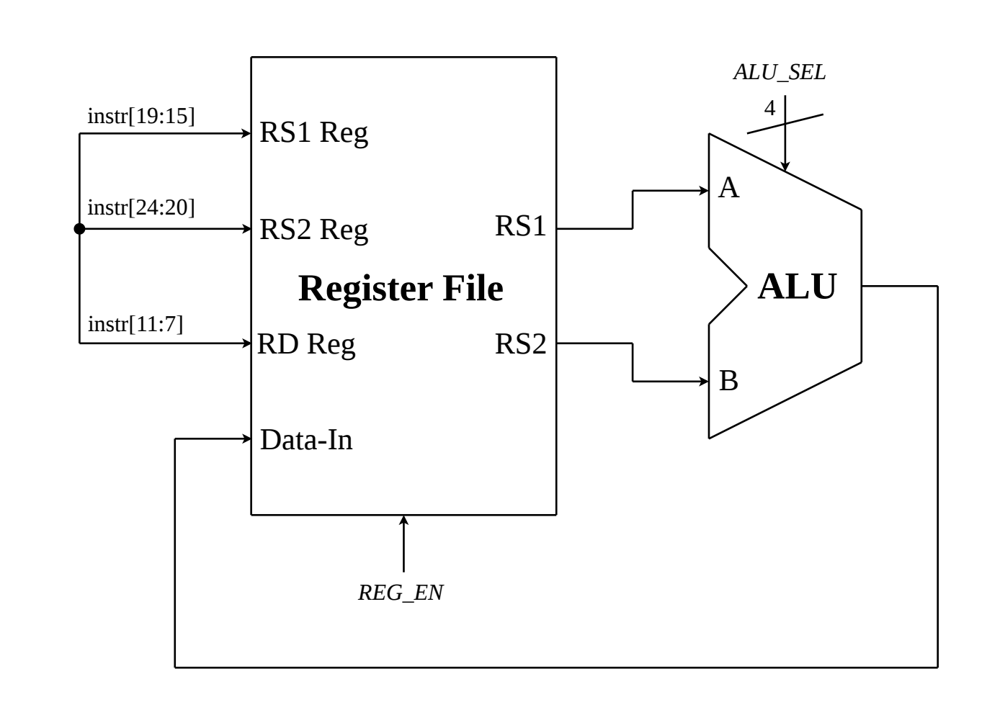
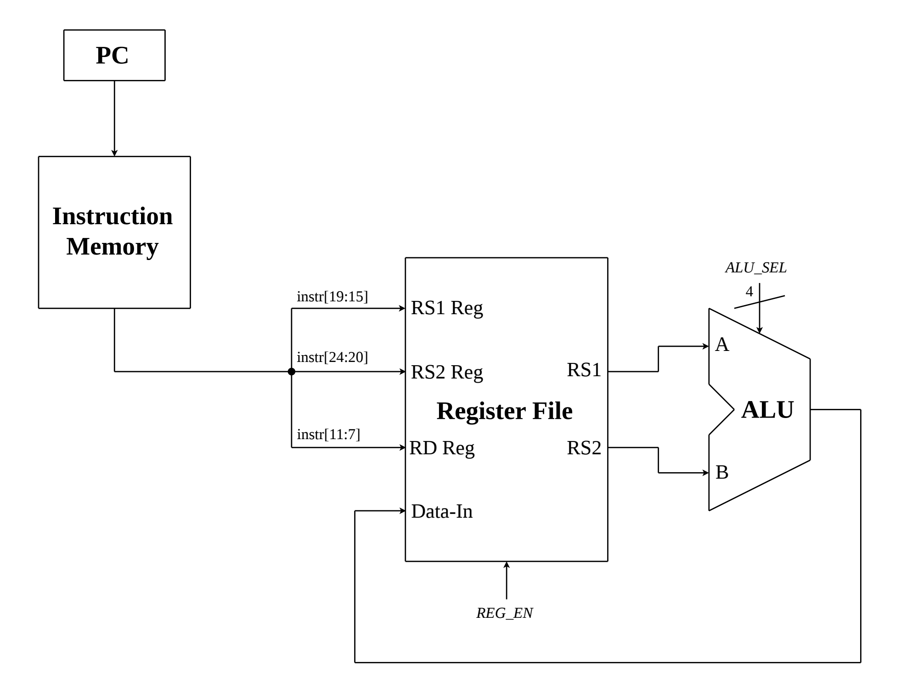

# Pipelined RISC-V CPU

This document is an indepth description and documentation of the Pipelined RISC-V CPU, an original personal project

## Table of Contents
- [Overview](#overview)
- [Building a Single-Cycle CPU](#building-a-single-cycle-cpu)
  - [General Procedure](#general-procedure)
  - [RV32I ISA](#rv32i-isa)
  - [Register-Register Operation](#register-register-operation)
  - [Register-Immediate Operation](#register-immediate-operation)
  - [Load](#load)
  - [Store](#store)
  - [Branch](#branch)
  - [Jump](#jump)
  - [Other](#other)
  - [Control Unit Design](#control-unit-design)
- [Pipelining a CPU](#pipelined)
- [Future Plans](#future)

## Overview

The following documentation fully describes this Central Processing Unit (CPU) design, beginning with an explaination of the approach I took to design my own custom single-cycle CPU for RISC-V, then Pipelining this CPU and implementing full hazard resolution. 

I intended for this documentation to not only serve as proof of this project's originality and functionality, but also as a general purpose guide for designing CPUs for any Instruction Set Architecture (ISA) for those who are interested to learn.

RISC-V is a free, open source ISA. All knowledge of RISC-V that I used for this project came from the "The RISC-V Instruction Set Manual, Volume I: Unprivileged Architecture," specifically chapter 2 which describes the RV32I ISA. This specification is freely avaliable for download at the RISC-V International website.

This CPU is a 5-stage (IF/ID/EX/MEM/WB) Pipelined CPU for a 37/40 instruction subset of RV32I. It uses forwarding, pipeline stalling, and register file write through for a full-proof hazard resolution. All individual components and the top-level CPU datapath were designed completely by myself and are original, although designs are likely to have similarities to other CPU projects. Verification of the CPU's functionality was confirmed using hand-written isolated module-level testbenches and hand-assembled machine code programs with GTKWave analysis.

## Building a Single-Cycle CPU

### General Procedure
There are many different approaches that one can take when designing a CPU of their own. However, my general process for designing this CPU was simply gaining an indepth understanding of each instruction or groups of instructions using the RISC-V Unpriviledge specification and inferring the hardware neccessary to implement those instructions.

Additionally, while this implementation is different from other people's implementations, and those implementations differ from one another, they often include many of the same components (e.g., ALU, Data Memory, Register File, etc.) and have similar structures. Therefore, comparing your implementation to others' is useful to ensure you are not doing something completely illogical. 

### RV32I ISA
The base RV32I ISA consists of 40 instructions. This implementation was for a 37-instruction subset, which excluded the `FENCE`, `EBREAK`, and `ECALL` instructions. For hardware implementation, the instructions can be broken into the following groups:

- Register-Register Arithemetic and Logical Operations
  - `ADD`, `SUB`, `XOR`, etc.
- Register-Immediate Arithmetic and Logical Operations
  - `ADDI`, `XORI`, etc.
- Loads
  - `LW`, `LH`, `LBU`, etc.
- Stores
  - `SB`, `SH`, and `SW`
- Conditional Branches
  - `BEQ`, `BGE`, etc.
- Unconditional Jumps
  - `JAL` and `JALR`
- Individual Instructions that don't fall under previous groups
  - `LUI`
  - `AUIPC`

A full table is shown below:
| Group | Instruction |
|------|------|
| Register-Register Operations | `ADD` `SUB` `XOR` `OR` `AND` `SLL` `SRL` `SRA` `SLT` `SLTU` |
| Register-Immediate Operations | `ADDI` `XORI` `ORI` `ANDI` `SLLI` `SRLI` `SRAI` `SLTI` `SLTIU` |
| Loads | `LB` `LH` `LW` `LBU` `LHU` |
| Stores | `SB` `SH` `SW` |
| Conditional Branches | `BEQ` `BNE` `BLT` `BGE` `BLTU` `BGEU` |
| Unconditional Jumps | `JAL` `JALR` |
| Other | `LUI` `AUIPC` |

Each of the instructions above fall under one of six instruction formats (R, I, S, B, U, J) which are show below:

*Credit: The RISC-V Instruction Set Manual, Volume I: Unprivileged Architecture*

There are few key observations that are helpful for implementation. Firstly, the destination register (rd), source register 1 (rs1), source register 2 (rs2), opcode, funct3, and funct7 are always located in the same place regardless of format. Addtionally, the immediate value generated can be completely determined by what instructon format is used. Finally, all instructions with the same opcode will use the same instruction format, meaning the instruction format can be completely determined using only the opcode.

A RISC-V Card is used to describe the key characteristics of each instruction:
| Inst | Name | FMT | Opcode | funct3 | funct7 |
|------|------|-----|--------|--------|--------|
| `ADD` | ADD | R | 0110011 | 0x0 | 0x00 |
| `SUB` | SUB | R | 0110011 | 0x0 | 0x20 |
| `XOR` | XOR | R | 0110011 | 0x4 | 0x00 |
| `OR` | OR | R | 0110011 | 0x6 | 0x00 |
| `AND` | AND | R | 0110011 | 0x7 | 0x00 |
| `SLL` | Shift Left Logical | R | 0110011 | 0x1 | 0x00 |
| `SRL` | Shift Right Logical | R | 0110011 | 0x5 | 0x00 |
| `SRA` | Shift Right Arith* | R | 0110011 | 0x5 | 0x20 |
| `SLT` | Set Less Than | R | 0110011 | 0x2 | 0x00 |
| `SLTU` | Set Less Than (U) | R | 0110011 | 0x3 | 0x00 |
| `ADDI` | ADD Immediate | I | 0010011 | 0x0 | |
| `XORI` | XOR Immediate | I | 0010011 | 0x4 | |
| `ORI` | OR Immediate | I | 0010011 | 0x6 | |
| `ANDI` | AND Immediate | I | 0010011 | 0x7 | |
| `SLLI` | Shift Left Logical Imm | I | 0010011 | 0x1 | imm[5:11]=0x00 |
| `SRLI` | Shift Right Logical Imm | I | 0010011 | 0x5 | imm[5:11]=0x00 |
| `SRAI` | Shift Right Arith Imm | I | 0010011 | 0x5 | imm[5:11]=0x20 |
| `SLTI` | Set Less Than Imm | I | 0010011 | 0x2 | |
| `SLTIU` | Set Less Than Imm (U) | I | 0010011 | 0x3 | |
| `LB` | Load Byte | I | 0000011 | 0x0 | |
| `LH` | Load Half | I | 0000011 | 0x1 | |
| `LW` | Load Word | I | 0000011 | 0x2 | |
| `LBU` | Load Byte (U) | I | 0000011 | 0x4 | |
| `LHU` | Load Half (U) | I | 0000011 | 0x5 | |
| `SB` | Store Byte | S | 0100011 | 0x0 | |
| `SH` | Store Half | S | 0100011 | 0x1 | |
| `SW` | Store Word | S | 0100011 | 0x2 | |
| `BEQ` | Branch == | B | 1100011 | 0x0 | |
| `BNE` | Branch != | B | 1100011 | 0x1 | |
| `BLT` | Branch < | B | 1100011 | 0x4 | |
| `BGE` | Branch >= | B | 1100011 | 0x5 | |
| `BLTU` | Branch < (U) | B | 1100011 | 0x6 | |
| `BGEU` | Branch >= (U) | B | 1100011 | 0x7 | |
| `JAL` | Jump And Link | J | 1101111 | | |
| `JALR` | Jump And Link Reg | I | 1100111 | 0x0 | |
| `LUI` | Load Upper Imm | U | 0110111 | | |
| `AUIPC` | Add Upper Imm to PC | U | 0010111 | | |

### Register-Register Operation
The most logical place to start in my view is with Register-Register Operations (RRO). In this group of instructions some arithmetic or logical operation is performed on the values from two source registers (rs1 and rs2), and the result is stored in a destination register (rd). There are many different types of RRO that are described by the RISC-V Card table above. From this description it is already clear what the majority of components needed are.

Firstly, we need some sort of component to compute these operations. An Arithmetic Logic Unit (ALU) performs an operation on two 32-bit input values, and has a corresponding 32-bit output. Select bits are also fed in as an input which describe which operation needs to performed.

| ALU_SEL | Operation |
|-------------|-----------|
| `0000` | ADD: `a + b` |
| `0001` | SUB: `a - b` |
| `0010` | XOR: `a ^ b` |
| `0011` | OR: `a \| b` |
| `0100` | AND: `a & b` |
| `0101` | SLL: `a << b[4:0]` |
| `0110` | SRL: `a >> b[4:0]` |
| `0111` | SRA: `$signed(a) >>> b[4:0]` |
| `1000` | SLT: `($signed(a) < $signed(b)) ? 1 : 0` |
| `1001` | SLTU: `($unsigned(a) < $unsigned(b)) ? 1 : 0` |

The next thing we will need is a Register File. This will contain 32 general purpose registers with 32-bit addressability (register x0 is forced to 0). The Register File allows for 1 sychronous write, and 2 asychronous reads per clock cycle. Therefore, there are 4 inputs, the first and second read address, the write address, and the write data. It also has a REG_EN input, which functions as a write enable (WE).

Notice how since the instruction formats fix the positions of rs1, rs2, and rd, we can directly wire these from the instruction. Addtionally, we will need some way to store instructions, and a way to access these instructions. This is where the Program Counter (PC) and Instruction Memory come in. The Instruction Memory holds the programs, and the PC stores the address of the current instruction. Instruction Memory has 8-bit or byte addressability, so each 32-bit instruction must align on a 4-byte boundary, and be spread across instructions (my implementation uses Big Endian).

### Register-Immediate Operation

### Load

### Store

### Branch
| ALU Control | Operation |
|-------------|-----------|
| `4'd0` | ADD: `a + b` |
| `4'd1` | SUB: `a - b` |
| `4'd2` | XOR: `a ^ b` |
| `4'd3` | OR: `a \| b` |
| `4'd4` | AND: `a & b` |
| `4'd5` | SLL: `a << b[4:0]` |
| `4'd6` | SRL: `a >> b[4:0]` |
| `4'd7` | SRA: `$signed(a) >>> b[4:0]` |
| `4'd8` | SLT: `($signed(a) < $signed(b)) ? 1 : 0` |
| `4'd9` | SLTU: `($unsigned(a) < $unsigned(b)) ? 1 : 0` |
| `4'd10` | BEQ: `(a == b) ? 1 : 0` |
| `4'd11` | BNE: `(a != b) ? 1 : 0` |
| `4'd12` | BGE: `($signed(a) >= $signed(b)) ? 1 : 0` |
| `4'd13` | BGEU: `($unsigned(a) >= $unsigned(b)) ? 1 : 0` |
### Jump

### Other

### Control Unit Design
