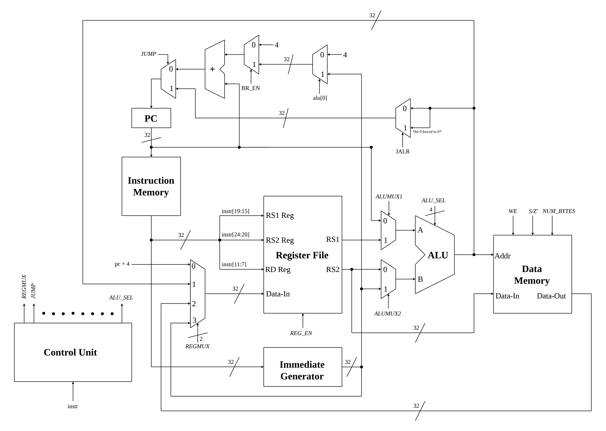

# Single-Cycle Datapath
This document provides an indepth explaination of the single-cycle datapath that I designed and tailored to the specific subset of 37 instructions I implemented. The first part of this document provides a high level overview of the datapath and its components. The second part of this document provides an indepth analysis of data flow for each instruction, providing an understanding for how the hardwired control unit functions. All datapath control signals are completely based on opcode, funct3, and funct7.

## Datapath Overview
The single-cycle datpath was designed to support the following subset of 37/40 instructions from the RV32I base ISA.

- Arithmetic/Logical: ADD, SUB, SLT, SLTU, AND, OR, XOR, SLL, SRL, SRA, ADDI, SLTI, SLTIU, ANDI, ORI, XORI, SLLI, SRLI, SRAI, LUI, AUIPC. (And by extension NOP)
- Jumps and Branches: JAL, JALR, BEQ, BNE, BLT, BLTU, BGE, BGEU
- Loads and Stores: LW, LH, LHU, LB, LBU, SW, SH, SB

FENCE, EBRAKE, and ECALL instructions were not implemented.

Below is a diagram of the datapath

The datapath has the following major components:
 - Arithmetic Logic Unit (ALU)
 - Data Memory
 - Instruction Memory
 - Register File
 - Program Counter
 - Immediate Generator
 - General purpose Multiplexers
 - Hardwired Control Unit

The ALU is used to perform arithmetic or logical operations on a pair of 32-bit inputs. The types of computations can be broken into register-register, register-immediate, pc-immediate, and pc-register (pc-register is not used in the implement set of instructions). The type of computation is chosen by the alumux1 and alumux2, and the operation performed is chosen my alu_sel. The ALU is used for register-regsiter computations, register-immediate computations, branch instructions, and AUIPC. 

The Data Memory is used for load and store instructions. It has a write enable (WE) input, sext/zext' (S/Z') input, and a NUM_BYTES input. The address accessed is calculated using the ALU by adding source register 1 (rs1) to the sign extended offset. The data written always comes from source register 2 (rs2). The data out only travels to the destination register (rd). The data memory is byte-addressed. Loads are either sign extended or zero extended before being stored in rd.

The Instruction Memory is used to store program code. It is also byte-addressed but all instructions are 32-bits wide. Therefore, each instruction must start at an address with a multiple of 4. The corresponding Program Counter (pc) is used to hold the address of the current instruction being executed. On non-branch and non-jump instructions, the pc increments by 4 bytes.

The Immediate Generator is used for many instructions, and the method by which the immediate value is optained depends on the instruction format. The opcodes are used to determine the instruction format, and the corresponding immediate value is obtained. 

Finally, the Hardwired Control unit outputs control signals that manage dataflow throughout the datapath. These include WE, REG_EN, Mux selectors, etc.

